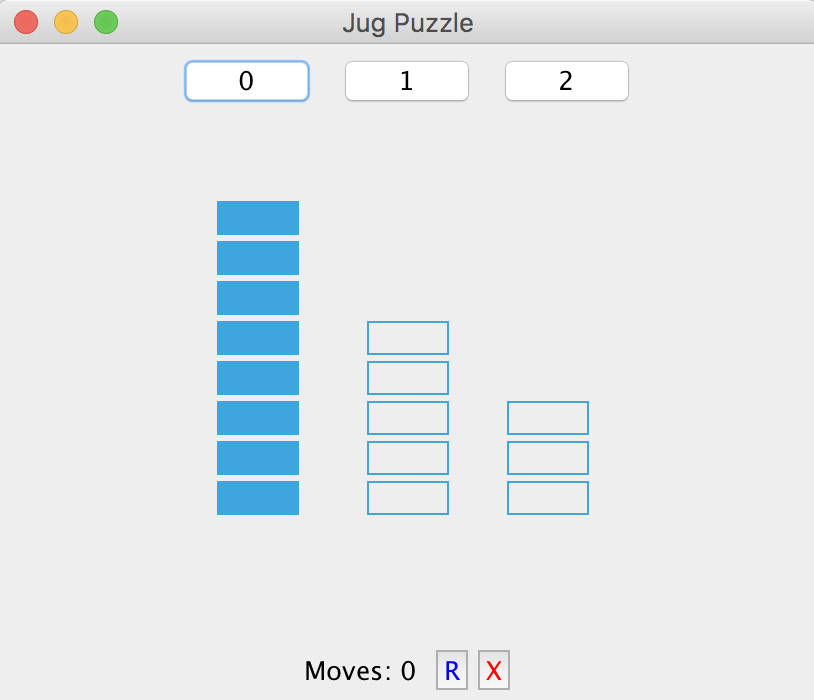

# jugPuzzleGUI
A small stimulation of the class Jug Puzzle game- Given 3 jugs of capacity 8, 5, and 3, with the first jug full of water, the objective is to fill the first and second jug with exactly 4L of water

This game can be played through Text or with a simple GUI.

